# Edu-Canvas product strategy

> Snapshot: 2026-07-17. The GitHub issue tracker is the source of truth for delivery status; this document records the product decisions, sequencing, and evidence gaps behind those issues.

## North-star outcome

Prove one trustworthy teacher-to-student loop in under three minutes:

```text
teacher's plain-language idea → safe visual lesson → student understanding → justified next step
```

The competition outcome is a judge seeing that loop work end to end. It is not a production KPI. The initial wedge is a bilingual (English/Arabic, including RTL) equivalent-fractions experience for Grades 3–6, beginning with Common Core Math.

The product promise is deliberately narrow:

- A teacher brings the intent and keeps judgment. The system drafts and explains options; it does not silently publish them.
- A student receives one focused, semantic activity with server-authoritative feedback and an understandable next action.
- Generated content is bounded, validated, teacher-approved, versioned immutably, and graded privately on the server.

This is not a generic worksheet generator or chat wrapper. The differentiator is a visible learning loop with a teacher trust boundary and an explainable prerequisite path.

## The critical journey

The issue graph describes one vertical slice. The sequence below is the intended order, not a claim that all steps are shipped:

```mermaid
flowchart LR
    I3["#3 Generate draft"] --> I18["#18 Validate curriculum + learning quality"]
    I18 --> I28["#28 Hard safety gate"]
    I28 --> I4["#4 Allowlisted A2UI preview"]
    I4 --> I17["#17 Reverse prerequisite path"]
    I17 --> I19["#19 Forward learning story"]
    I19 --> I5["#5 Teacher approve + publish"]
    I5 --> I6["#6 Server-authoritative grading"]
    I6 --> I7["#7 Reveal + deterministic next activity"]
    I7 --> I8["#8 Teacher mastery reason"]
    I7 --> I9["#9 Student hardening"]
    I8 --> I10["#10 Teacher hardening"]
    I9 --> I11["#11 Judge-ready demo"]
    I10 --> I11
    I27["#27 Preview correctness blocker"] -. "must be resolved before learner-safe claim" .-> I4
```



The hard safety gate is cross-cutting: a `hard_block` keeps unsafe content out of preview and Share; a `warning` stays visible for teacher review; only a passing or explicitly accepted safe result can continue. The reverse path and forward story are product artifacts that make the learning decision inspectable, not hidden chain-of-thought.

## Product choices and non-choices

| We choose                                                                | We deliberately defer or reject                                           |
| ------------------------------------------------------------------------ | ------------------------------------------------------------------------- |
| One polished equivalent-fractions wedge before broad curriculum coverage | Multiple subjects, a full Grades 3–6 graph, and large activity browsing   |
| Teacher review and approval of every generated variant                   | Runtime student generation or silent model changes after approval         |
| A2UI/semantic DOM as the core interaction contract                       | Generated HTML/JavaScript and canvas-only accessibility                   |
| A bounded prerequisite graph with a visible reason for the next activity | An opaque “personalization” claim with no deterministic trace             |
| Server-only answer keys, mastery, and permissions                        | Client-submitted scores or model-based grading of student identity/images |
| Synthetic data and seeded accounts for the demo                          | Real student data before DPA, residency, security, and consent gates      |

The strategic moat is trust plus learning clarity: the teacher can see what will happen, the student can understand why it happened, and the system cannot bypass the safety boundary for speed.

## Seven-layer orientation

This audit used the repository and issue graph, not direct user research. “Partial” means the product decision is coherent enough to build but still needs evidence or an explicit contract.

| Layer                        | Current state                | What is known                                                                                                                                                     | What remains unknown or risky                                                                                                                                                                                 |
| ---------------------------- | ---------------------------- | ----------------------------------------------------------------------------------------------------------------------------------------------------------------- | ------------------------------------------------------------------------------------------------------------------------------------------------------------------------------------------------------------- |
| Observed behaviour           | **Assumed**                  | Issue reports, browser QA, and the demo brief describe a teacher authoring job and a student matching flow.                                                       | No teacher/student interviews, activation data, or moderated usability evidence. This is the current bottleneck.                                                                                              |
| Domain                       | **Partial**                  | Equivalent fractions, prerequisite nodes, activity versions, immutable packs, attempts, tenant boundaries, and A2UI catalog rules are clear for the seeded slice. | The broader standards model and subject expansion are intentionally deferred.                                                                                                                                 |
| User needs                   | **Partial**                  | Teachers need fast preparation with control and reasons; students need a focused activity, feedback, and a next step.                                             | These needs are inferred from the brief and issues rather than observed in context.                                                                                                                           |
| Product and service strategy | **Partial**                  | The wedge, trust boundary, competition outcome, and issue sequence are now explicit in this document.                                                             | The order still needs validation against real teacher value and the open preview-correctness blocker.                                                                                                         |
| Conceptual model             | **Partial**                  | Draft, validator result, activity pack, immutable version, attempt, prerequisite path, story beats, and next activity are emerging as the shared language.        | Shared semantics for page state and bounded multi-page flows remain open in [issue #31](https://github.com/abodacs/edu-canvas/issues/31).                                                                     |
| Interaction flow             | **Partial**                  | The landing story is coherent and the target teacher → student loop is described in [the walking skeleton](walking-skeleton.md).                                  | Generation, recovery states, approval, grading, and adaptation still need to become one exercised flow across [issues #3–#11](https://github.com/abodacs/edu-canvas/issues).                                  |
| Surface                      | **Partial, strongest slice** | PR #25 establishes a calm, bilingual, responsive, semantic, reduced-motion landing surface.                                                                       | [Issue #27](https://github.com/abodacs/edu-canvas/issues/27) reports a distractor-only selection that can produce a success reveal in the landing preview; do not call that preview learner-safe until fixed. |

The lowest unresolved layer is observed behaviour. The next highest-value activity is therefore `/layers-observed-behaviour`: test the core teacher and student loop before investing in generalized transport, standards packs, or multi-page flows.

## Delivery sequence

### Now

- Treat [issue #27](https://github.com/abodacs/edu-canvas/issues/27) as a correctness blocker and keep the learner-safe claim out of the UI/docs until it is fixed.
- Deliver [issue #3](https://github.com/abodacs/edu-canvas/issues/3) / [PR #24](https://github.com/abodacs/edu-canvas/pull/24), then [issue #18](https://github.com/abodacs/edu-canvas/issues/18) for bounded curriculum and learning-quality validation.
- Add [issue #28](https://github.com/abodacs/edu-canvas/issues/28)'s `pass` / `warning` / `hard_block` gate before preview and Share.

### Next

- Complete the allowlisted preview in [issue #4](https://github.com/abodacs/edu-canvas/issues/4), then make the reverse prerequisite path ([#17](https://github.com/abodacs/edu-canvas/issues/17)) and forward learning story ([#19](https://github.com/abodacs/edu-canvas/issues/19)) visible to the teacher.
- Close the trusted teacher-to-student loop through approval/publish ([#5](https://github.com/abodacs/edu-canvas/issues/5)), private grading ([#6](https://github.com/abodacs/edu-canvas/issues/6)), reveal/next activity ([#7](https://github.com/abodacs/edu-canvas/issues/7)), and the teacher/student hardening issues ([#8](https://github.com/abodacs/edu-canvas/issues/8), [#9](https://github.com/abodacs/edu-canvas/issues/9), [#10](https://github.com/abodacs/edu-canvas/issues/10)).
- Use [issue #11](https://github.com/abodacs/edu-canvas/issues/11) as release proof, not as a substitute for exercising the loop.

### Later

- Generalize catalog and transport in [issue #29](https://github.com/abodacs/edu-canvas/issues/29).
- Add versioned subject-specific standards packs in [issue #30](https://github.com/abodacs/edu-canvas/issues/30).
- Add bounded multi-page `learn → interact → reveal` flows in [issue #31](https://github.com/abodacs/edu-canvas/issues/31).

Do not widen the surface area until the core loop is correct, observable, and trusted.

## Cheapest tests for the riskiest assumptions

| Assumption                                                                      | Smallest useful test                                                                                                  | Evidence to keep                                                                   |
| ------------------------------------------------------------------------------- | --------------------------------------------------------------------------------------------------------------------- | ---------------------------------------------------------------------------------- |
| Teachers prefer a plain-language idea plus reviewable options to hand-authoring | Five teacher interviews with a timed clickable composer; measure whether they can approve or correct four variants    | Time to first approved activity, correction count, and words used to explain trust |
| The reverse path and forward story increase trust without adding cognitive load | Show teachers a raw variant set versus the same set with path/story context; ask which one they would publish and why | Choice, confidence, and explanation quality                                        |
| Students understand the reveal and can recover from a distractor                | Five moderated student sessions on a 320px phone and desktop, including a distractor-first attempt                    | Selection accuracy, recovery time, and whether the student can explain the reveal  |
| A deterministic reason is useful to teachers                                    | Replay fixed attempts and ask teachers to predict and approve the next activity before showing the system reason      | Prediction accuracy, approval rate, and reason comprehension                       |

Until these tests are run, optimize for one clear, safe, explainable loop rather than breadth. The strategy is strong enough to guide implementation; its main missing proof is real user behaviour.
